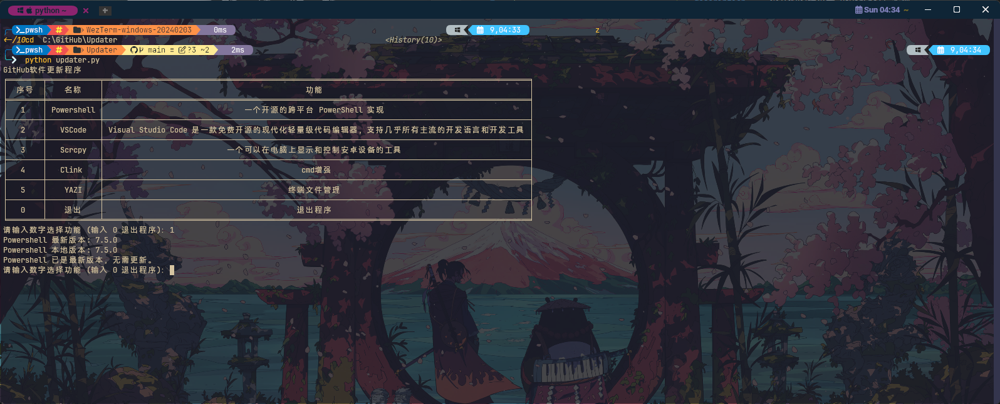

<div align="right">
    <h6>
        <picture>
            <source type="image/svg+xml" media="(prefers-color-scheme: dark)" srcset="https://assets.aiwebextensions.com/images/icons/earth/white/icon32.svg">
            
        </picture>
        &nbsp;简体中文 |
        <a href="/readme_en.md">English</a>
    </h6>
</div>

# 用于检测 GitHub 仓库的版本信息，并下载最新版本。

配置软件清单说明:

```INI
;显示的名称
[YAZI]
;显示的描述
description = 终端文件管理
;获取最新版本信息的URL
release_url=https://github.com/sxyazi/yazi/releases/latest
;下载最新版本的URL
download_url=https://github.com/sxyazi/yazi/releases/download/v{lasted_version}/yazi-x86_64-pc-windows-msvc.zip
;解压到指定文件夹
unzip_folder={ChinaGodMan_U}\Program Files\command_line_tools
;下载保存的路径
save_path={temp_dir}\YAZI{lasted_version}.zip
;插件路径
plugin=yazi.py
;插件中检测本地版本的方法名
check_version=check_version
;下载完成后的方法名,下载完成后传递环境变量 env = ["save_path", save_path, "lasted_version", latest_version, "ChinaGodMan_U", ChinaGodMan_U, "unzip_folder", unzip_folder]
done=unzip
;下载前的方法名,用于一些特殊版本号
hook_download=fetch_latest_release_url
```


