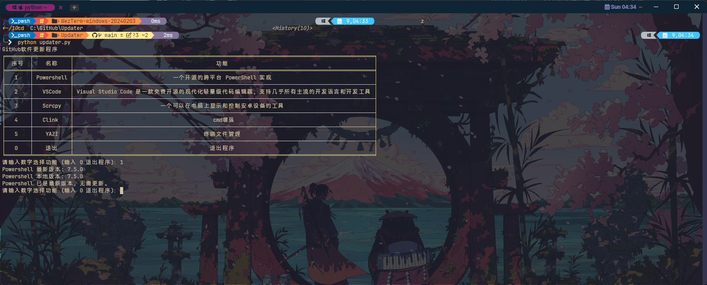

<div align="right">
    <h6>
        <picture>
            <source type="image/svg+xml" media="(prefers-color-scheme: dark)" srcset="https://assets.aiwebextensions.com/images/icons/earth/white/icon32.svg">
            
        </picture>
        &nbsp;English |
        <a href="/readme.md">简体中文</a>
    </h6>
</div>

# Used to detect the version information of the GitHub repository and download the latest version.

Configuration software list description:

```INI
; Display name
[YAZI]
; Display description
description = Terminal file management
; URL to fetch the latest version information
release_url=https://github.com/sxyazi/yazi/releases/latest
; URL to download the latest version
download_url=https://github.com/sxyazi/yazi/releases/download/v{lasted_version}/yazi-x86_64-pc-windows-msvc.zip
; Folder to extract the files to
unzip_folder={ChinaGodMan_U}\Program Files\command_line_tools
; Path to save the downloaded file
save_path={temp_dir}\YAZI{lasted_version}.zip
; Path to the plugin
plugin=yazi.py
; Method name in the plugin to check the local version
check_version=check_version
; Method name to execute after download; environment variables passed after download:
; env = ["save_path", save_path, "lasted_version", latest_version, "ChinaGodMan_U", ChinaGodMan_U, "unzip_folder", unzip_folder]
done=unzip
; Method name to execute before download, used for special version numbers
hook_download=fetch_latest_release_url

```


